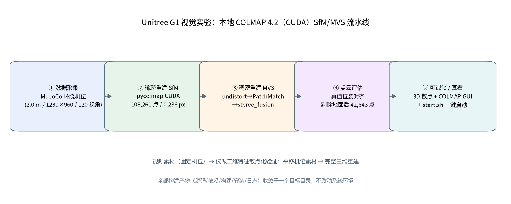
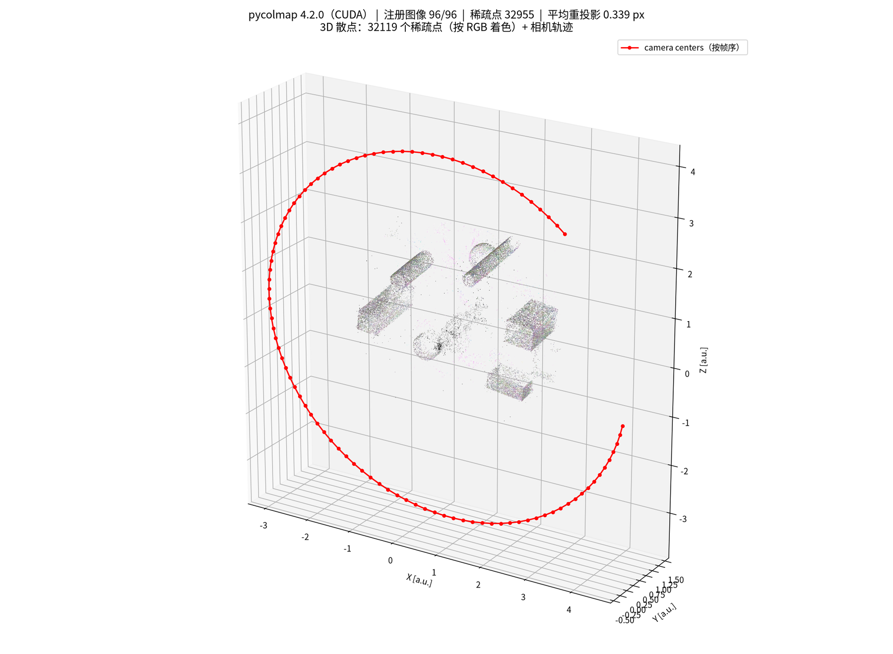
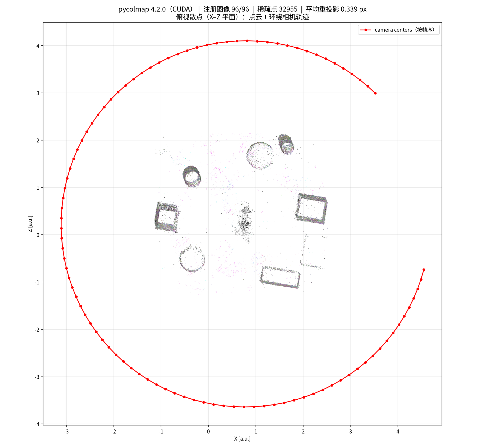
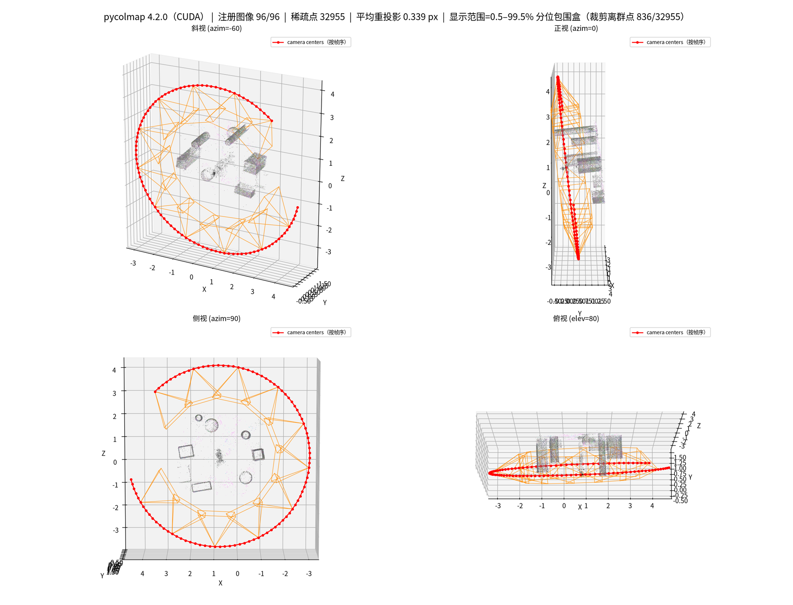
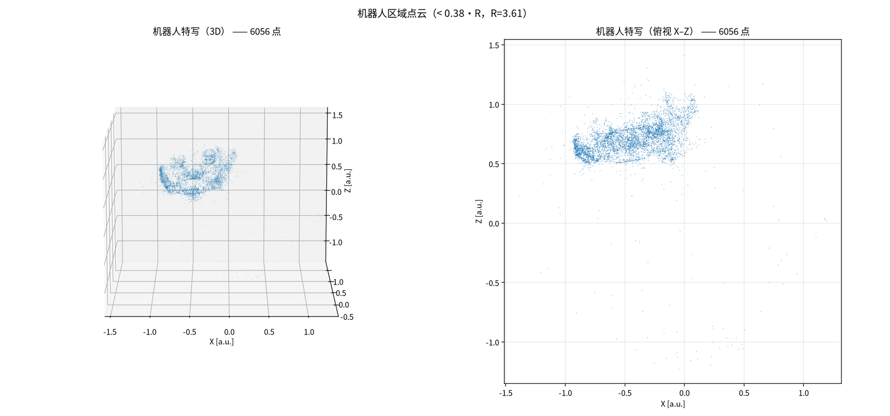
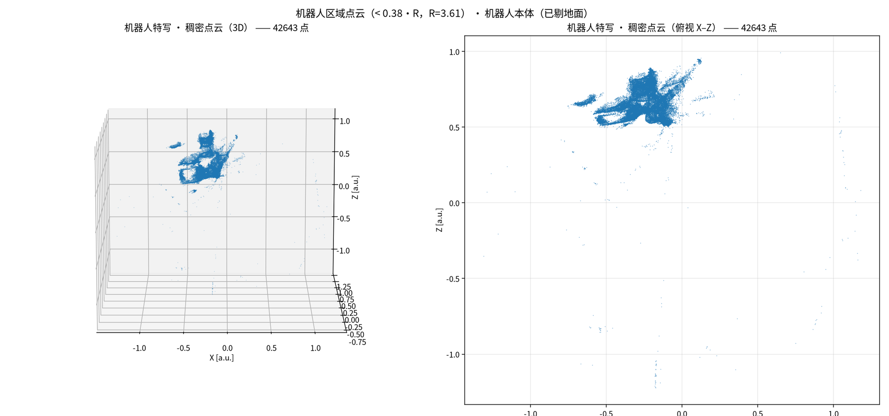
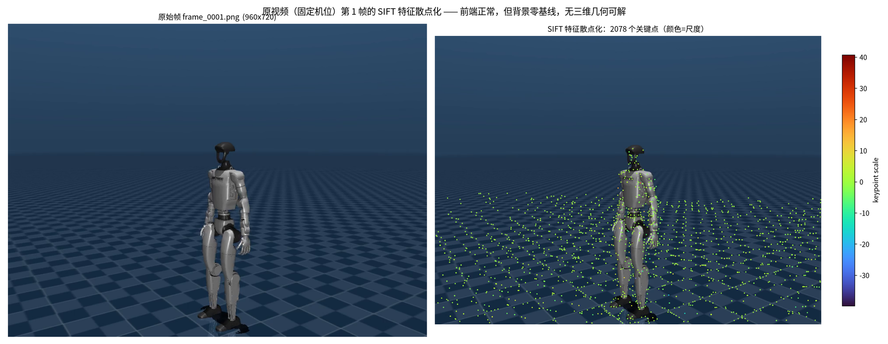
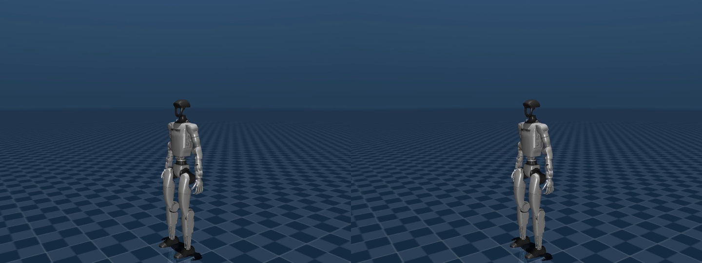
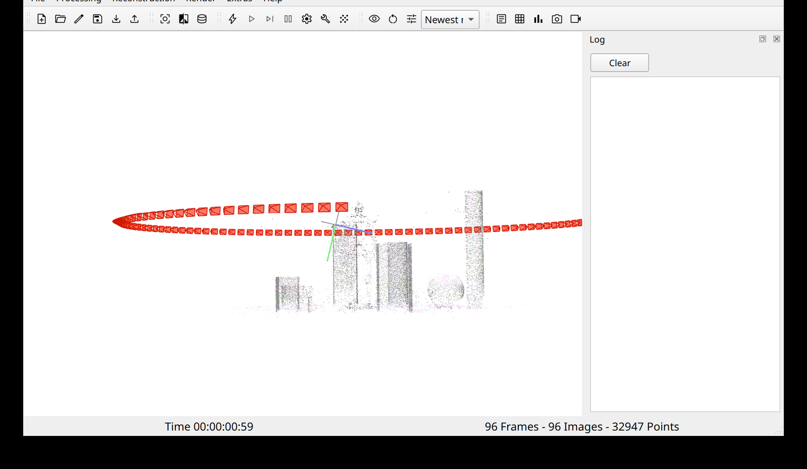
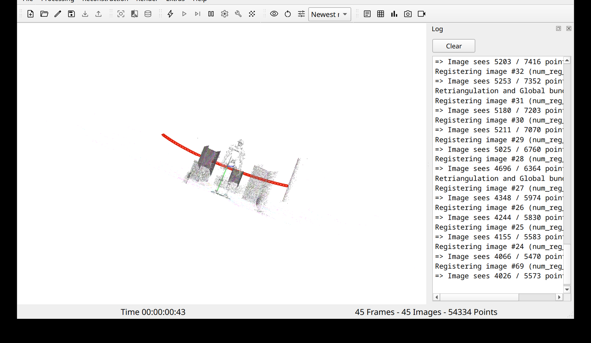

# Unitree_G1_COLMAP

面向 **Unitree G1 人形机器人视觉实验**的本地 COLMAP 部署与 SfM/MVS 验证工程。

从 MuJoCo 仿真视频/图像出发，完成 **稀疏重建 → 稠密点云 → 精度评估 → 可视化/查看** 全链路，
并给出可复现脚本与量化指标。所有构建产物（源码 / 依赖 / 构建 / 安装 / 日志）收敛于**一个目标目录**，
不写系统路径、不用 `sudo/apt`、不污染既有 conda / pip 环境。



---

## 一、效果图

### 1. 稠密点云 + 相机轨迹（三维散点）



灰白点云为三角化出的场景结构（盒体 / 圆柱 / 球体），红色为 120 个相机中心（按帧序连成弧线）；
该结果来自一条 **4 秒、120 帧的环绕机位视频**。

### 2. 俯视散点（几何结构最直观）



相机轨迹是完整圆弧（半径 ≈ 3.6 个单位），环内可清楚数出 4 个矩形（盒体）、3 个圆环（圆柱）、
1 个实心圆（球体）——重建几何与仿真场景一致。

### 3. 四视角总览 + 相机锥体



橙色为每个相机的视锥（位姿来自 `cam_from_world`），四张子图共用同一坐标范围（按 0.5–99.5% 分位裁剪离群点）。

### 4. 机器人点云加密：稀疏 → 稠密

| 稀疏（加密采集后） | 稠密 MVS（剔除地面） |
|---|---|
|  |  |
| 6,056 点 | **42,643 点** |

机器人表面是低纹理金属材质、且在远景机位下画面占比很小，因此做了「**拉近机位 + 提高分辨率 +
增加视角 + 稠密 MVS**」的加密实验，机器人本体点数 **1,764 → 42,643（约 24×）**。

### 5. 固定机位视频的特征散点化



固定机位视频（背景零基线）无法做三维重建，但前端链路完全正常：单帧 **2,078 个 SIFT 关键点**
（CUDA 提取，颜色表示尺度）。这是判断"素材不适配"而非"部署有问题"的关键证据。

### 6. 固定机位的判据：首末帧对比



第 1 帧与第 46 帧背景完全重合，仅机械臂姿态不同 ⇒ 相机零位移 ⇒ 对极几何退化，SfM 无解。

### 7. COLMAP GUI 中的查看效果

| 稀疏模型（相机轨迹 + 点云） | 稠密 / 加密模型 |
|---|---|
|  |  |

---

## 二、关键指标

| 数据集 | 采集条件 | 注册图像 | 稀疏点 | 平均重投影 | 机器人本体点 | 稠密点 |
|---|---|---:|---:|---:|---:|---:|
| 环绕数据集（36 视角，含真值位姿） | 960×720，机位 3.0 m | 36/36 | 16,075 | **0.170 px** | — | 242,565 |
| 视频（移动机位，96 帧） | 960×720，扫过 300° | 96/96 | 32,955 | 0.339 px | 1,764 | — |
| 视频（固定机位，46 帧） | 960×720，相机静止 | 无解 | — | — | — | — |
| **加密采集（120 视角）** | **1280×960，机位 2.0 m** | **120/120** | **108,261** | **0.236 px** | **6,056** | **809,590** |

与 MuJoCo 真值位姿对比（相似变换对齐后）：

| 指标 | 数值 |
|---|---|
| 相机中心相对误差 | **0.041 %**（0.0012 m / 2.98 m 轨迹） |
| 相机朝向绝对误差 | 0.65°（其中 0.65° 为真值提取的常值约定偏差） |
| 相机朝向相对误差（剔除常值偏移） | **0.021°** |

> 评估脚本自带对齐器自检：对估计施加已知相似变换后仍能复原（残差不变），确保指标可信。

---

## 三、环境与依赖

| 项 | 值 |
|---|---|
| 系统 | Ubuntu（glibc 2.43，内核 7.0） |
| GPU / 架构 | NVIDIA Blackwell，`sm_120`（本机为 RTX 5070 Laptop，8 GB） |
| CUDA | **系统 `/usr/local/cuda-13.2`**（nvcc 13.2.86），C++ 与 Python 侧共用 |
| 编译器 | GCC / G++ 15.2 |
| 构建 | CMake 3.31 + Ninja，Release，`-j16` |
| COLMAP | **4.2.0** 源码编译（tag `4.2.0`）：CUDA + Qt6 GUI + MVS + OpenGL + CGAL，ONNX 关闭 |
| 依赖前缀 | conda-forge 独立前缀：Ceres 2.2 / SuiteSparse+CHOLMOD / OpenImageIO 2.5 / Qt 6.9 / CGAL / Boost 1.84 / GLEW |
| Python | pycolmap 4.2.0（**CUDA 版**，源码构建，复用已安装的 COLMAP 静态库） |

依赖要点：COLMAP 4.2 的强制依赖是 Boost(graph, program_options)、Eigen3、OpenImageIO、Metis、
SQLite3、CHOLMOD、Ceres、glog/gflags、OpenGL+GLEW、Qt6；`flann` / `freeimage` / `opencv` **不再需要**
（近邻检索改为 FetchContent 拉取 FAISS）。

---

## 四、目录结构

```text
<COLMAP_ROOT>/                  # 部署目标目录（全部产物收敛于此）
├── src/COLMAP/                 # 官方源码（tag 4.2.0）
├── deps/                       # conda-forge 依赖前缀（与系统/既有环境隔离）
├── build/                      # CMake + Ninja 构建目录
├── install/                    # 本地安装（bin/ lib/ include/ share/）
├── logs/                       # 环境检查 / 依赖决策 / 构建 / 安装 / 验证日志
├── env.sh                      # 一键加载环境（PATH / LD_LIBRARY_PATH / CMAKE_PREFIX_PATH）
├── deploy_colmap.sh            # 可复现部署（deps → src → configure → build → install → verify）
├── verify_colmap.sh            # 部署自检（14 项）
├── build_pycolmap.sh           # 构建 CUDA 版 pycolmap wheel
└── start.sh                    # 转发入口（完整实现见下方工作目录的 start.sh）

<WORKSPACE>/                    # 实验侧工作目录
├── start.sh                    # 一键启动（dense / sparse-robot / sparse-video / orbit / ply / raw / cli）
├── python/                     # pycolmap 流水线脚本（本仓库 scripts/ 同名文件）
├── orbit_multiview/            # 环绕机位数据集 + 渲染脚本 + 真值位姿
├── robot_close/                # 加密采集数据集（1280×960 / 120 视角）
├── movingcam_video/            # 移动机位视频 + 抽帧
├── py_out/                     # 各次重建输出（model / dense / dense_cli / 可视化）
└── logs/                       # 各阶段日志
```

---

## 五、快速开始

```bash
# 1) 部署（幂等，可中断续跑）
bash deploy_colmap.sh                # 依赖前缀 → 源码 → 配置 → 编译 → 安装 → 自检
bash deploy_colmap.sh verify         # 只跑自检

# 2) 加载环境（只影响当前 shell）
source env.sh
colmap --version                     # → COLMAP 4.2.0 (... with CUDA)

# 3) 一键启动 GUI 查看结果
bash start.sh --list                 # 列出可打开的模型
bash start.sh                        # 默认：机器人稠密点云 809,590 点
bash start.sh sparse-robot           # 加密后的稀疏模型 108,261 点
bash start.sh ply                    # 打开稠密点云 PLY
```

> 重建产物体积较大，未随仓库分发；`assets/sample_robot_pointcloud.ply` 提供 **15 万点降采样示例**，
> 可用 CloudCompare / MeshLab / COLMAP（`File → Import model from…`）直接打开。

---

## 六、流水线明细

### 第 1 步：数据采集（MuJoCo）

`scripts/render_orbit_multiview.py` 渲染环绕机位数据集，并在渲染时**直接导出真值位姿**：

- 相机绕场景扫过设定角度（如 300°），半径、俯仰、观察点可配；
- **每个视角渲染前都 `mj_resetDataKeyframe`**，保证"相机运动、场景刚体"——SfM 成立的前提；
- 真值位姿取自渲染实际使用的 `MjvScene` 相机（pos / forward / up → COLMAP 约定），与图像严格同源。

> 经验：MuJoCo 默认场景地面是**周期棋盘格**，SIFT 会整格错配、导致重建退化解（实测相机轨迹不成圆）。
> 因此 `scripts/make_sfm_textures.py` 生成**非周期随机纹理**替换地面，并加入不同深度的体块提供视差。

### 第 2 步：稀疏重建（pycolmap + CUDA）

```bash
python scripts/colmap_pipeline.py --images <images_dir> --out <out_dir> \
    --matcher exhaustive --device cuda \
    --max-image-size 1280 --max-features 32768 \
    --peak-threshold 0.004 --edge-threshold 20 --scatter
```

要点：`pycolmap.Device.cuda` 走 GPU；`CameraMode.SINGLE` 单相机；加密特征用更低峰值阈值 + 更高边缘阈值；
输出 `model/`、`sparse.ply`、`visualization.png`、`stats.json`。

### 第 3 步：稠密重建（MVS）

```bash
bash scripts/run_dense_mvs.sh <model_dir> <images_dir> <dense_out> 1000
# image_undistorter → patch_match_stereo(geom_consistency=true) → stereo_fusion
```

### 第 4 步：精度评估与密度分析

```bash
# 与真值位姿对比（相似变换对齐 + 相对朝向误差）
python scripts/eval_orbit_gt.py --colmap-txt <txt_model> --gt <gt_poses.json>

# 机器人区域密度（按真实尺度折算 + RANSAC 剔除地面）
python scripts/analyze_robot_density.py --model <model_dir> \
    --dense-ply <fused.ply> --cam-radius-true 2.0 --exclude-floor --out <prefix>
```

### 第 5 步：查看 / 可视化

- 三维散点与四视角图：`python scripts/colmap_pipeline.py --model <model_dir> --scatter`
- GUI 查看：`bash start.sh dense`
- PLY → COLMAP 模型（保留相机位姿）：`python scripts/ply_to_colmap_model.py fused.ply out_dir --base-model <sparse_model>`

---

## 七、踩坑记录（COLMAP 4.2 实测）

1. **选项改名**：4.x 的 GPU 开关统一为 `--FeatureExtraction.use_gpu` / `--FeatureMatching.use_gpu`；
   旧教程里的 `--SiftExtraction.use_gpu` 会直接报 `unrecognised option`。
2. **CGAL 遮蔽 CMake 模块**：依赖前缀中的 CGAL 会把自带的旧 `FindEigen3.cmake` 注入
   `CMAKE_MODULE_PATH`，而它靠正则解析 `EIGEN_WORLD_VERSION`（Eigen 3.4 已移除该宏），
   于是 PoseLib 配置阶段报 `Could NOT find Eigen3: Found unsuitable version ".."`。
   解决：在源码 `cmake/` 放一个转发到 config 模式的 `FindEigen3.cmake` 垫片
   （该目录位于 `CMAKE_MODULE_PATH` 首位，且**不修改任何上游文件**）。
3. **不要用 `CMAKE_FIND_PACKAGE_PREFER_CONFIG=ON`**：它会跳过 COLMAP 自带的 `FindCHOLMOD.cmake`，
   使 `CHOLMOD::CHOLMOD` 目标缺失（conda 的 CHOLMOD config 只定义 `SuiteSparse::CHOLMOD`）。
4. **GUI 载入模型**：`--project_path` 必须指向 **`project.ini` 文件路径**；4.2 的启动参数
   `--import_path` **不会**导入模型（多种模型实测均为 0 Points），需在界面里
   `File → Import model…`（`Ctrl+I`）选择模型目录，或 `File → Import model from…` 直接选 `.ply`。
5. **PLY → COLMAP 模型**：`model_converter` 只支持"导出" PLY；反向需
   `pycolmap.Reconstruction().import_PLY()` 再 `write()`（`scripts/ply_to_colmap_model.py` 已实现）。
6. **pycolmap 的 RUNPATH**：scikit-build-core 会覆盖 `CMAKE_INSTALL_RPATH`，导致
   `import pycolmap` 找不到依赖前缀里的 Boost/Ceres；加 `-DCMAKE_INSTALL_RPATH_USE_LINK_PATH=ON`
   可让 CMake 自动并入全部链接目录。
7. **稀疏点云的离群点**：三维散点图必须做分位裁剪（实测有跨到 ±25 而场景仅 ±2.5 的点），
   且显示范围要取"点云 ∪ 相机中心"的并集，否则轨迹/视锥会被挤出画框。

---

## 八、许可

本仓库代码遵循 [MIT License](LICENSE)。COLMAP 本体为 BSD-3-Clause（见其官方仓库）。
第三方资源（Unitree G1 MuJoCo 模型等）遵循各自原始许可。
